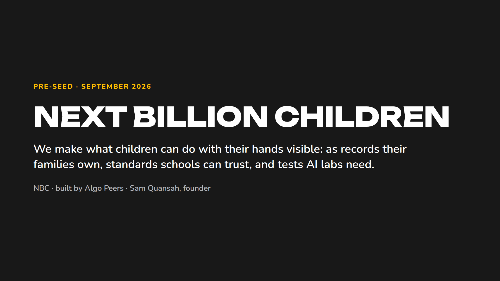
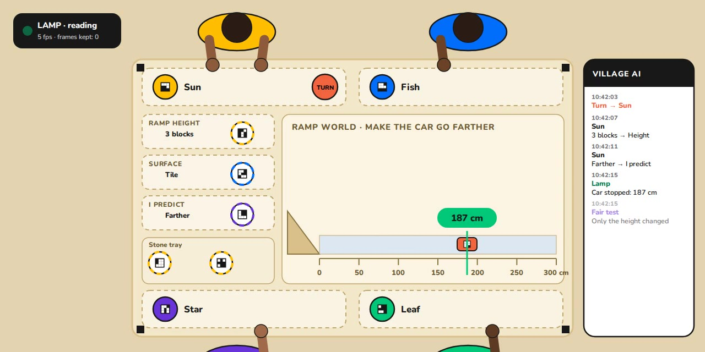

# NBC · Next Billion Children

**We make what children can do with their hands visible: as records their families own, standards schools can trust, and tests AI labs need.**

Built by **Algo Peers** (Cape Coast, Ghana). Founder: **Sam Quansah**. Stage: **pre-seed**, raising in the next six months.

## Start here

| | |
|---|---|
| **Deck (14 slides)** | [deck/NBC_Deck.pdf](deck/NBC_Deck.pdf) |
| **Website prototype** | [site/index.html](site/index.html). Download it and open it in a browser, or view it on GitHub Pages once enabled |
| **Concept film (61 s)** | [demo/Village_Table_Concept_Film.mp4](demo/Village_Table_Concept_Film.mp4) |
| **Prototype demo (55 s)** | [demo/Village_Table_Prototype_Demo.mp4](demo/Village_Table_Prototype_Demo.mp4) |
| **Forecast** | [docs/FORECAST.md](docs/FORECAST.md) · [docs/revenue_base_case.csv](docs/revenue_base_case.csv) |
| **Milestones and go-to-market** | [docs/MILESTONES.md](docs/MILESTONES.md) |
| **How we treat children's data** | [docs/CHILDRENS_DATA.md](docs/CHILDRENS_DATA.md) |

## The problem

Most children in the world learn at tables, not screens. Ghana now requires every child to learn computing, and most of its schools have few working computers. When a child works something out with their hands, nothing is kept: teachers can't see who is ready for what, and parents get nothing to hold on to. Grades measure recall. Nobody measures whether a skill holds up when the task changes.

## The insight

**Answers are getting cheaper. Capability isn't.** AI learned from what people wrote, and that record has already been scraped at scale. What has never been recorded is what people can *do*: real tasks with real objects, what help they had, and whether the skill held when the task changed. That happens in rooms, and almost none of it is captured. NBC builds the infrastructure to capture it: with consent, owned by families, and never sold.

## What NBC is

One layer of infrastructure, in five parts:

| Part | What it does |
|---|---|
| **Learning Worlds** | Hands-on games with real objects, written in an open format anyone can run |
| **Skill records** | What a child has shown, under what conditions and with what help, owned by the family |
| **Facilitators** | Local people run the sessions, helped by an AI on their own phones |
| **The NBC Standard** | Independent certification of schools and centres |
| **AI testing** | AI labs test physical reasoning on our worlds against results from paid adults. Never children's data |

## The first product: the Village Table

This is how NBC captures learning in a room, cheaply.
- **Stamped pieces:** bottle caps, clay or wood with a printed code, at under a cent each.
- **A game cloth:** sets the task.
- **A lamp:** a retired phone above the table that reads every move. It has no microphone and keeps no images.
- **A turn stone:** gives every move an owner, with no camera on anyone's face.
- **A school AI:** runs on the staff's own phones and keeps each child's record.

When the same skill shows up in a different game, the record shows that it carried over.

## Who pays

1. **Schools and programmes (now):** Learning Worlds kits, a yearly subscription per facilitator, and licences for small independent schools.
2. **AI labs (now):** tests of physical reasoning built from our worlds, with results from consenting, paid adults.
3. **Funders, governments and certification (later):** pay-for-results contracts per verified skill, and fees to certify schools and centres.

Families always use NBC for free. From year 3, AI lab revenue is capped at half of total revenue, so NBC stays an education company.

## Where we are

**Algo Peers, since 2021, Cape Coast:**
- 1,000+ children reached through our programmes.
- Families pay for our after-school sessions.
- $93,511 in grants, including from Global Affairs Canada.
- 31 public schools assessed (11,214 students).

**NBC, started September 2026:**
- A Village Table prototype and demo.
- A website prototype.
- An open format for Learning Worlds (v0.1).
- **No pilots, users or revenue yet.** The prototypes use simulated data; reading real pieces with a real camera is the first build task.

## Team

**Sam Quansah, founder.**
- Founded Algo Peers in 2021 in Cape Coast, starting in a four-square-metre maker space.
- Ed.M. candidate, Harvard Graduate School of Education (2027).
- 2024 Mandela Washington Fellow; Harvard i-lab member.

The Cape Coast team runs programmes day to day.

**Hiring first:**
- a technical co-founder (computer vision and embedded systems);
- a learning-science lead;
- a head of trust and data protection.

## Contact

[linkedin.com/in/samquansah-ceo](https://www.linkedin.com/in/samquansah-ceo/)

---

### Notice

- **Rights.** © 2026 Algo Peers. All rights reserved. This repository is shared so prospective investors and partners can evaluate the company. No licence is granted to copy, adapt or commercialise any material here; see [LICENSE](LICENSE).
- **Forward-looking statements.** Forecasts, prices and milestones are targets and plans, not results or promises.
- **Simulated demo.** The prototypes, film and demo use simulated data; the children shown are fictional.
- **What is not here.** Technical designs, research data and partner details are available under NDA on request.
