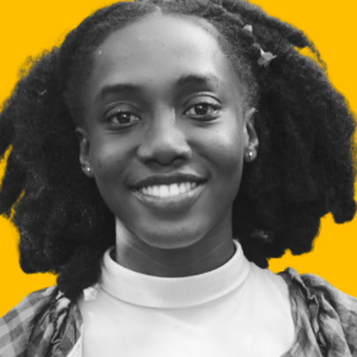
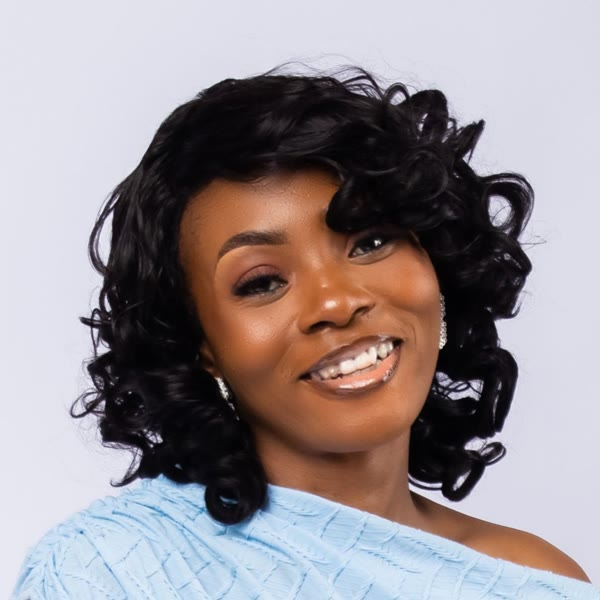

# NBC · Next Billion Children

**Learning infrastructure for the next billion children.**

Algo Peers is building NBC: **programmable physical learning environments where children build, experiment and develop capabilities with shared AI.**

Founder: **Sam Quansah**. Base: Cape Coast, Ghana. Stage: **pre-seed**, raising in the next six months.

## Start here

| | |
|---|---|
| **Deck (23 slides + 4 appendix)** | [deck/NBC_Deck.pdf](deck/NBC_Deck.pdf) |
| **Website prototype** | [site/index.html](site/index.html). Download it and open it in a browser, or view it on GitHub Pages once enabled |
| **Market, economics and projections** | [docs/ECONOMICS.md](docs/ECONOMICS.md) · [docs/projections_scenarios.csv](docs/projections_scenarios.csv) |
| **Milestones and go-to-market** | [docs/MILESTONES.md](docs/MILESTONES.md) |
| **Public-private partnerships** | [docs/PARTNERSHIPS.md](docs/PARTNERSHIPS.md) |
| **Brand guide and strategy** | [brand/NBC_Brand_Guide.pdf](brand/NBC_Brand_Guide.pdf) (14 pages) · [docs/BRAND.md](docs/BRAND.md) · logos and tokens in [brand/](brand/) |
| **How we treat children's learning and data** | [docs/CHILDRENS_DATA.md](docs/CHILDRENS_DATA.md) |
| **Concept film and demo** | [demo/](demo/): one possible future, instrumented version of a Learning World (simulated) |

## The problem

**Answers are getting cheaper. Capability isn't.** AI makes explanations and finished work easy to get. The chance to investigate, build, get it wrong and try again still costs time, materials and skilled adults. The problem takes different forms:
- a child in Cape Coast has few chances to experiment with real things;
- a child with plenty of AI can't explain or repeat a result when the help changes;
- a child shows real understanding through action, and no test records it.

## What NBC is

| Part | What it does |
|---|---|
| **Programmable materials** | micro:bit, sensors and everyday materials whose roles and rules change, so one kit supports many worlds |
| **Learning Worlds** | Designed learning experiences around real problems in the child's own world (below) |
| **Shared AI** | One AI shared by a learning centre helps facilitators prepare, translate and give feedback. No device per child |
| **Facilitator support** | Guides, worked examples and prompts, so people beyond our team can run great sessions |
| **Evidence of capability** | What a child can explain, create and do when the task changes. Families can see and correct it |

**Learning comes first.** The experience has to be worth it for the child. Evidence supports the next learning decision, and a child's record is never the product. Cameras, sensors and AI are added only where they clearly beat a simpler approach.

## What a Learning World is

A Learning World is a designed, multi-session experience, not a worksheet or a token game. It follows four phases from Algo Peers' Root Access pedagogy:
1. **Belong:** a story and a real problem from the child's world. "Do I see my world here?"
2. **Investigate:** children build with programmable materials and ask AI good questions.
3. **Understand:** predict, test, explain, revise. "What is really going on underneath?"
4. **Apply:** build something for someone real, then show the skill in a new situation.

Each world ships with a facilitator guide, a materials list, AI prompts and short checks. Printed cards and tokens are only the low-cost floor for rooms with nothing else.

**Example: Farm World.** Algo Peers already ran it as a module on technology for food security.
- **Who took part:** 51 learners aged 7–15, from 34 communities; 53% were girls.
- **What they built:** 7 working prototypes, including AI pest detection, smart irrigation, soil moisture monitors and a vegetable classifier, using micro:bit, Teachable Machine and recycled materials.
- **What the numbers show:** participation and outputs, not a measured learning effect.

NBC turns worlds like this into repeatable packages other facilitators can run.

## First customer and offer

- **Customer:** independent operators of recurring hands-on programmes for children aged about 9–12, starting in Cape Coast.
- **Who uses it:** children use it, a facilitator runs it, and the programme owner buys it.
- **Offer: NBC Learning Worlds.** Reusable physical experiences, facilitator guidance and a short evidence summary that helps choose each child's next step.

## How we make money

- **Core:** a programme or site fee from operators.
- **Options:** a shared AI service, and licensed experience packages.
- **Stands alone:** the learning business has to work without the options.
- **Never sold:** we never sell children's data.
- **Access:** public-private partnerships fund children who can't pay; see [PARTNERSHIPS.md](docs/PARTNERSHIPS.md).

## Market and projections

| | Size | Basis |
|---|---|---|
| **TAM** | $29–53B a year | Global after-school programmes, 2025 (industry estimates; methods vary). 1.4 billion students are enrolled worldwide |
| **SAM** | ~$99M a year | Ghana's ~27,400 primary and junior high schools × $3,600 per site a year |
| **SOM (year 5)** | ~$3.2M a year | 800 paying sites, about 3% of Ghana's schools (central scenario) |

**Year-5 revenue by scenario:** low $0.36M (100 sites) · central $3.2M (800 sites) · high $11.3M (2,500 sites, including a second country). These are projections from stated assumptions, not forecasts, and we will rebuild them from pilot data. Details: [ECONOMICS.md](docs/ECONOMICS.md).

**Where this goes:** Learning Worlds and facilitators come first. Next come records families own. Later, the NBC Standard (independent certification of worlds and centres, "the IB for the AI era") and pay-for-results contracts. Physical-reasoning tests for AI labs, using paid adults only, stay a research option behind evidence gates.

**The 10-year ambition** if NBC becomes the standard is about $254M a year (range $94M–$407M). That requires every gate to pass, and a path from the high scenario into many countries. It is an ambition, not a projection; the deck shows what has to be true.

## Where we are

**Algo Peers, since 2021, Cape Coast:**
- 1,000+ children reached through our programmes.
- Families pay for our after-school programmes.
- $93,511 in grants, including from Global Affairs Canada.
- 31 public schools assessed (11,214 students).
- Our own learning platform and educator training.

**NBC:**
- A thesis, three Learning Worlds and a draft task format.
- Website and classroom prototypes.
- **No NBC pilots or revenue yet.** Algo Peers' results don't prove NBC works; the pilot will test that.

## Team

|  |  |  |  |
|---|---|---|---|
| **Sam Quansah** Founder | **Vera Aninakwah** Learning Designer | **Nana Adwoa Nsiah** Learning Experience Designer | **Deborah Quansah** Sales and Marketing Lead |

**Sam Quansah, founder.**
- Founded Algo Peers in 2021 in Cape Coast, starting in a four-square-metre maker space.
- Originator of the Root Access pedagogy.
- Ed.M. candidate in Global, International and Comparative Education, Harvard Graduate School of Education (2027).
- 2024 Mandela Washington Fellow; Harvard i-lab member.
- Former mentor for the Google Africa Developer Scholarship.

**Vera Aninakwah, Learning Designer.**
- Culturally responsive AI, computing and robotics for K-12; supervises our practitioner team.
- BBC micro:bit Champion and Africa Community Lead.
- Google certificates in Data Analytics and IT Support; Applied Data Science, WorldQuant University.
- Penn GSE scholarship recipient, M.S.Ed. Learning Sciences and Technologies.

**Nana Adwoa Nsiah, Learning Experience Designer and Creative Technologist.**
- Leads our Learning Media Lab: culturally grounded, visual learning tools, using animation and games.
- micro:bit Champion; LLB holder.
- Cuppy Africa Steinhardt Scholars Award and Global Citizen Scholarship, New York University.

**Deborah Quansah, Sales and Marketing Lead.** Leads sales and marketing to programme operators, schools and families.

**Hiring first:** a learning scientist, to design the tests, and a technical lead for physical computing and offline software.

## Contact

[linkedin.com/in/samquansah-ceo](https://www.linkedin.com/in/samquansah-ceo/)

---

### Notice

- **Rights.** © 2026 Algo Peers. All rights reserved. This repository is shared so prospective investors and partners can evaluate the company. No licence is granted to copy, adapt or commercialise any material here; see [LICENSE](LICENSE).
- **Forward-looking statements.** Plans, pass lines and illustrations are not results or promises.
- **Simulated demo.** The prototypes, film and demo use simulated data; the children shown are fictional.
- **What is not here.** Technical designs, research data and partner documents are available under NDA on request.
